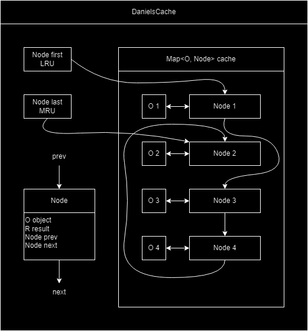
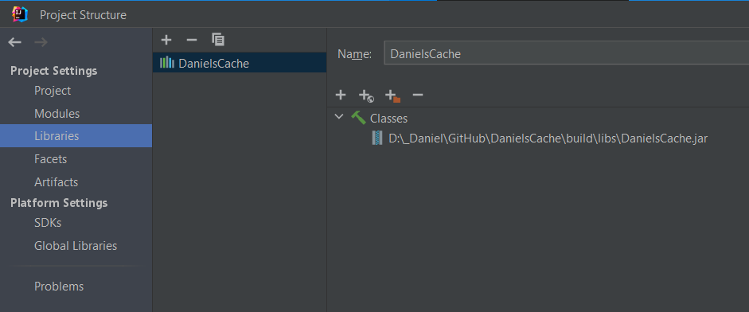

# DanielsCache
A simple caching library for keeping a certain fixed amount of your computed objects with an LRU eviction strategy.

---
### Time Complexity

| Complexity (usually) | Description             |
|----------------------|-------------------------|
| `O(mapper function)` | Fetching unseen element |
| `O(1)`               | Fetching seen element   |
| `O(1)`               | Eviction of LRU element |
### How this works internally
##### Fetching an unseen element
- The result is computed and the value is stored in the `Hashmap` in a `new Node`
- The element is added as `last`
##### Fetching a seen element
- The result is stored in the `Hashmap`, so it can be fetched and extracted from the `Node`
- The element is removed from its current position and `prev` and `next` get linked together
- The element is added as `last`
##### Eviction of the LRU element
- `first` points to the LRU element
- `first.object` is removed from the `Hashmap`
- `first.next` is the new `first`
- `first.prev` gets unlinked
##### Example of how it could look on the inside

### I want to use and/or adapt this project
Go for it - I tried to make everything as readable and modifiable as possible. Check out the explanation below, and the license in the 'LICENSE' file. Regardless of the license, it would be cool if you somehow mentioned, that you got this code from here :)
### How to use
1. Add as library (here shown in IntelliJ) or add the code directly to your project
   
2. Create a new Cache instance with `DanielsCache<O, R> cache = new DanielsCache<>(int maxSize, Function<O, R> mapper);`
   - `O` is the input type e.g. a `String` from an incoming REST request
   - `R` is the computed type e.g. the object created from the REST string
3. Use `cache.get(O object)` to get the corresponding `R result`
   - The result is computed if it is not in the cache
   - But simply fetched if it is
   - Eventually the cache fills up, and the LRU (least recently used) element is evicted